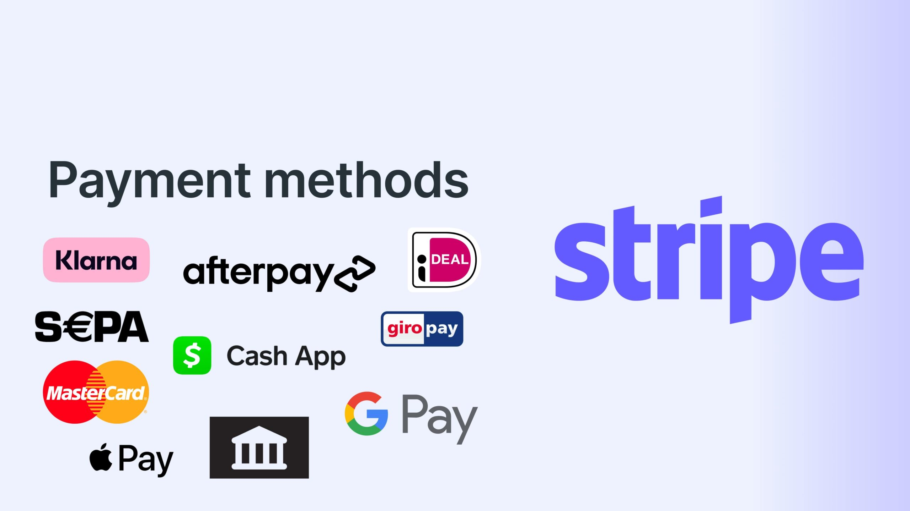
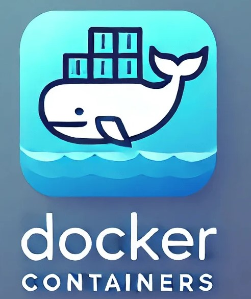
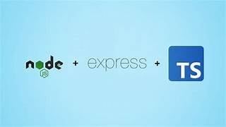
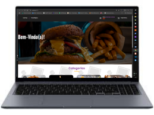
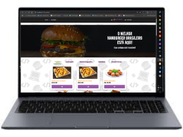
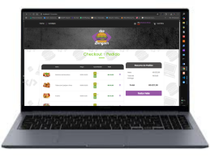
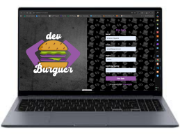
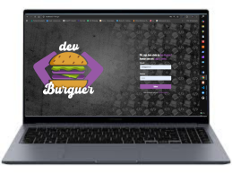

<h1># 🍔 DevBurger - E-commerce de Hamburgueria</h1> 

Aplicação Full Stack para gerenciamento de hamburgueria, desenvolvida com React, Node.js, MongoDB e Stripe, permitindo pedidos online, autenticação de usuários e painel administrativo. <h2> O sistema permite que os usuários naveguem pelo cardápio, realizem pedidos e efetuem pagamentos. Além disso, possui uma área administrativa para gerenciamento de produtos e acompanhamento dos pedidos.

Este projeto foi desenvolvido com foco em boas práticas de desenvolvimento Front-end e Back-end, utilizando React, Node.js, MongoDB, Ubuntu, DockerContainer, Httpie e Beekeper e integração com APIs. DevBurger - E-commerce de Hamburgueria, com Professor Rodolfo Mori com **React**, utilizando **Vite** como bundler, **JavaScript**, e integração com uma **API externa** para operações de CRUD. O app permite Vizualizar Cardápios de Lanches Variável como Humbergeres, Bebidas, Sobremesas e Porções. Também temos está funcções como Listar, Adicionar, Editar Valores, Cadastrar Novos Usuários, Fazer Login de Usuários e Cadastras Novos Produtos e excluir de forma dinâmica e responsiva.
<a href="https://rodolfomori.com.br/Devclub">clique aqui </a>

## 🚀 Tecnologias Utilizadas e Instaladas
Front-end
React
Vite
JavaScript
Styled Components
React Router DOM
React Hook Form
Yup
Axios
React Toastify
Stripe

  
  
  
  
  
  
    
  
  
   
   
  
  
  
  
  
  
   
    
     
      
      

## 🚀 Tecnologias Utilizadas
Back-end
Node.js
Express
MongoDB
Mongoose
JWT
Bcrypt
 
<h2>
  

   
   
   
   
   
   
   
   
  

   
   
🚀 Demonstração do Sistema em fotos e Videos para
vizualizar e entender melhor veja os videos logo a baixo por capitulo e Tópicos!
  
   
   
   

🖼️ Telas do Projeto
Página Inicial

A 1º página inicial apresenta os produtos disponíveis da hamburgueria com uma interface moderna e intuitiva, demostrando Tela de Home, Cardapio e Carrinho.
 
🎥 Fotos e Vídeos de Demonstração
 </h2>

<!-- Telas no Notebook -->
 

    ## 🚀 Demonstração
  
💻 Tela do Projeto Rodando no Notebook

   
   
  

    TELA DE HOME
     
     
    
     
      
     
    TELA DE CARDAPIO
     
     
    
   
     
     
    TELA DE CARRINHO
       
   
    

 
 
 
    A 2º página inicial apresenta a Tela de Cadastro, Tela de Login e Tela de Carrinho produtos da hamburgueria com uma interface moderna e intuitiva, demostrando. 
 
🎥 Fotos e Vídeos de Demonstração
 </h2>

   <!-- Telas no Notebook -->
 
 
 
 

    ## 🚀 Demonstração
  
💻 Tela do Projeto Rodando no Notebook

   
   
  

    TELA DE CADASTRO
     
     
    
     
      
     
    TELA DE LOGIN
     
     
    
   
     
    TELA DE CARRINHO
       
   
    
    

  

 

<!-- Telas no Tablet -->
 
 

  
🖥 Tela do Projeto Rodando no Tablet

   
  

    
    
  

 

<!-- Telas no Smartphone -->
 
 

  
📱 Tela do Projeto Rodando no Smartphone

   
  

    
    
  

 

---

# React + Vite

This template provides a minimal setup to get React working in Vite with HMR and some ESLint rules.

Currently, two official plugins are available:

- [@vitejs/plugin-react](https://github.com/vitejs/vite-plugin-react/blob/main/packages/plugin-react/README.md) uses [Babel](https://babeljs.io/) for Fast Refresh
- [@vitejs/plugin-react-swc](https://github.com/vitejs/vite-plugin-react-swc) uses [SWC](https://swc.rs/) for Fast Refresh

## Expanding the ESLint configuration

If you are developing a production application, we recommend using TypeScript and enable type-aware lint rules. Check out the [TS template](https://github.com/vitejs/vite/tree/main/packages/create-vite/template-react-ts) to integrate TypeScript and [`typescript-eslint`](https://typescript-eslint.io) in your project.

## 📦 Instalação

<h2>
1. Clone o repositório:
