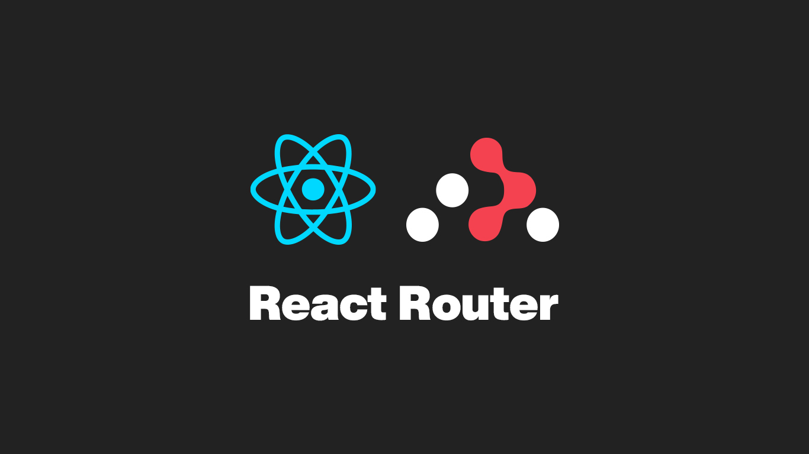
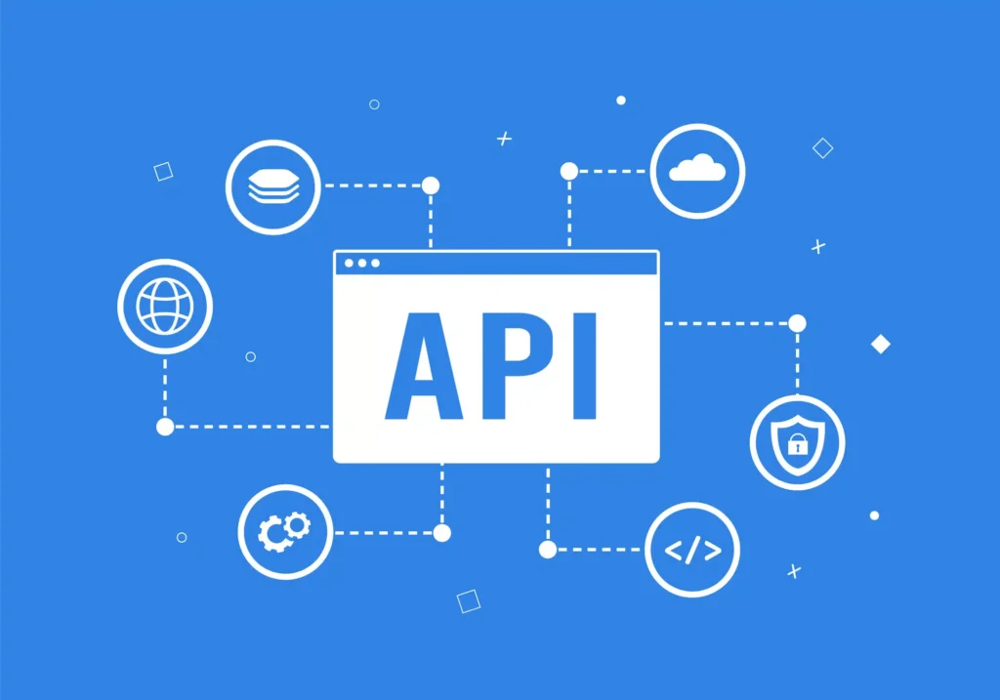
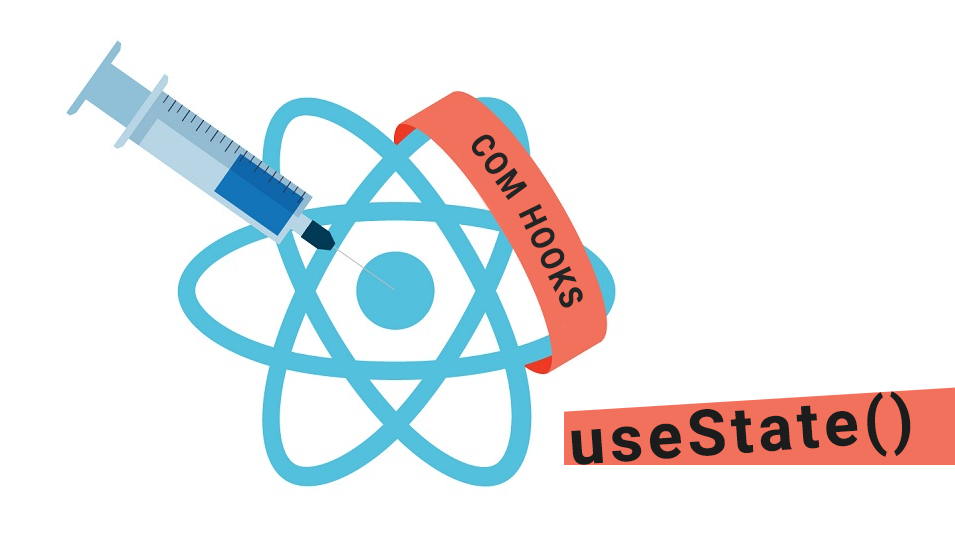

<h1># 🍔 DevBurger - E-commerce de Hamburgueria</h1> 

Aplicação Full Stack para gerenciamento de hamburgueria, desenvolvida com React, Node.js, MongoDB e Stripe, permitindo pedidos online, autenticação de usuários e painel administrativo. <h2> O sistema permite que os usuários naveguem pelo cardápio, realizem pedidos e efetuem pagamentos. Além disso, possui uma área administrativa para gerenciamento de produtos e acompanhamento dos pedidos.

Este projeto foi desenvolvido com foco em boas práticas de desenvolvimento Front-end e Back-end, utilizando React, Node.js, MongoDB e integração com APIs. DevBurger - E-commerce de Hamburgueria, com Professor Rodolfo Mori com **React**, utilizando **Vite** como bundler, **JavaScript**, e integração com uma **API externa** para operações de CRUD. O app permite Vizualizar Cardápios de Lanches Variável como Humbergeres, Bebidas, Sobremesas e Porções. Também temos está funcções como Listar, Adicionar, Editar Valores, Cadastrar Novos Usuários, Fazer Login de Usuários e Cadstras Novos Produtos e excluir de forma dinâmica e responsiva.
<a href="https://rodolfomori.com.br/Devclub">clique aqui </a>

## 🚀 Tecnologias Utilizadas
Front-end
React
Vite
JavaScript
Styled Components
React Router DOM
React Hook Form
Yup
Axios
React Toastify
Stripe

  
  
  
  
  
  
    
  
  
   
   
  

## 📦 Instalação

<h2>
1. Clone o repositório:
