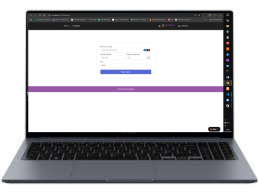
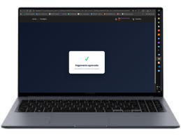
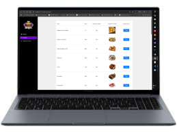
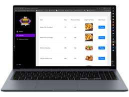
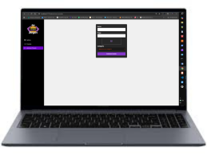
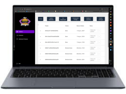

<!-- ====================================================== -->

<!--                  DEVBURGER README                       -->

<!--          Desenvolvido por Emerson Alves Filgueira      -->

<!-- ====================================================== -->

<p align="center">


</p>

<h1 align="center">
🍔 DevBurger
</h1>

<h3 align="center">
Uma experiência completa de E-commerce para Hamburguerias
</h3>

<p align="center">

Sistema Full Stack desenvolvido com foco em performance, organização de código, experiência do usuário e boas práticas de desenvolvimento moderno.

</p>

---

<p align="center">

🚧 Projeto em constante evolução

</p>

---

# 📖 Sobre o Projeto

O **DevBurger** é uma aplicação Full Stack desenvolvida para simular uma plataforma completa de pedidos online para uma hamburgueria.

Mais do que apenas listar produtos, o sistema reproduz um fluxo real de compra, permitindo que clientes naveguem pelo cardápio, criem uma conta, façam login, adicionem produtos ao carrinho e concluam pagamentos de forma segura.

Além da experiência do cliente, o projeto possui um **Painel Administrativo**, responsável pelo gerenciamento completo da aplicação, permitindo controlar categorias, produtos e pedidos.

Todo o projeto foi desenvolvido utilizando uma arquitetura moderna baseada em React no Front-end e Node.js no Back-end, com persistência dos dados em MongoDB e integração com Stripe para processamento de pagamentos.

---

# 🎯 Objetivos

O principal objetivo deste projeto foi aplicar, na prática, conceitos utilizados em aplicações Full Stack modernas, explorando desde a criação da interface até o desenvolvimento da API, autenticação de usuários, integração com banco de dados e serviços externos.

Durante o desenvolvimento foram aplicados conceitos como:

* Arquitetura em camadas
* Componentização
* Consumo de APIs
* Autenticação JWT
* Upload de imagens
* CRUD completo
* Integração com Stripe
* Responsividade
* Organização de código
* Separação entre Front-end e Back-end

---

# ⭐ Destaques do Projeto

✔ Sistema completo de autenticação

✔ Carrinho de compras dinâmico

✔ Integração com Stripe

✔ Cadastro de usuários

✔ Área administrativa

✔ Cadastro de produtos

✔ Cadastro de categorias

✔ Gerenciamento de pedidos

✔ Interface moderna

✔ Layout responsivo

✔ Integração entre Front-end e Back-end

✔ Banco de dados MongoDB

✔ API REST

---

# 🖥️ Visão Geral da Plataforma

O sistema foi dividido em duas grandes áreas:

## 👤 Área do Cliente

Destinada aos usuários responsáveis por realizar pedidos.

Nesta área é possível:

* Criar uma conta
* Fazer Login
* Navegar pelo catálogo
* Pesquisar categorias
* Adicionar produtos ao carrinho
* Alterar quantidades
* Remover produtos
* Finalizar pedidos
* Efetuar pagamentos utilizando Stripe

---

## 👨‍💼 Área Administrativa

Destinada ao gerenciamento completo da hamburgueria.

Nesta área é possível:

* Criar categorias
* Editar categorias
* Excluir categorias
* Cadastrar produtos
* Atualizar produtos
* Remover produtos
* Visualizar pedidos
* Gerenciar todo o catálogo

---

# 🚀 Demonstração

Em breve este projeto contará com:

* 🎬 GIFs animados
* 📹 Vídeos completos
* 📸 Capturas de tela em alta resolução
* 💻 Demonstrações da Área do Cliente
* ⚙ Demonstrações da Área Administrativa

---

# 📸 Primeira Visualização

<p align="center">


</p>

<p align="center">

A tela inicial apresenta uma interface moderna, destacando categorias, produtos e proporcionando uma experiência intuitiva para o usuário.

</p>

---

---

# 🛠️ Tecnologias Utilizadas

O DevBurger foi desenvolvido utilizando tecnologias modernas amplamente empregadas no mercado de desenvolvimento Full Stack.

Cada ferramenta foi escolhida para desempenhar um papel específico na construção da aplicação, desde a interface do usuário até o processamento de pagamentos e gerenciamento do banco de dados.

---

# 🎨 Front-end

O Front-end foi desenvolvido utilizando **React** com **Vite**, priorizando desempenho, componentização e uma excelente experiência do usuário.

<div align="center">

| Tecnologia           | Função                  |
| -------------------- | ----------------------- |
| ⚛ React              | Construção da Interface |
| ⚡ Vite               | Build Tool              |
| 🟨 JavaScript        | Linguagem Principal     |
| 💅 Styled Components | Estilização             |
| 🧭 React Router DOM  | Rotas                   |
| 📋 React Hook Form   | Formulários             |
| ✔ Yup                | Validação               |
| 🌐 Axios             | Comunicação com API     |
| 🔔 React Toastify    | Notificações            |
| 💳 Stripe            | Pagamentos              |

</div>

<br>

<p align="center">


</p>

---

# ⚙ Back-end

O Back-end foi desenvolvido utilizando Node.js e Express, seguindo uma arquitetura organizada para fornecer uma API REST segura e escalável.

<div align="center">

| Tecnologia    | Função                 |
| ------------- | ---------------------- |
| 🟢 Node.js    | Runtime JavaScript     |
| 🚀 Express    | API REST               |
| 🍃 MongoDB    | Banco de Dados         |
| 📦 Mongoose   | Modelagem do Banco     |
| 🔐 JWT        | Autenticação           |
| 🔑 Bcrypt     | Criptografia de Senhas |
| 🧩 Prisma ORM | Gerenciamento do Banco |

</div>

<br>

<p align="center">


</p>

---

# 🧰 Ferramentas Utilizadas

Durante o desenvolvimento do projeto foram utilizadas diversas ferramentas para facilitar a criação, testes e gerenciamento da aplicação.

<div align="center">

| Ferramenta            | Finalidade             |
| --------------------- | ---------------------- |
| 💻 Visual Studio Code | Desenvolvimento        |
| 🐳 Docker             | Containers             |
| 🐧 Ubuntu             | Ambiente Linux         |
| 🌐 HTTPie             | Testes da API          |
| 🗄️ Beekeeper Studio  | Gerenciamento do Banco |
| 🌿 Git                | Controle de Versão     |
| ☁ GitHub              | Hospedagem do Código   |

</div>

<br>

<p align="center">


</p>

---

# 🏛️ Arquitetura da Aplicação

A aplicação foi organizada utilizando uma arquitetura em camadas, separando responsabilidades entre Front-end, Back-end, Banco de Dados e serviços externos.

```text
                               👤 Usuário
                                   │
                                   ▼
                     React + Vite (Interface)
                                   │
                     React Router + Axios
                                   │
                                   ▼
                       Node.js + Express API
                                   │
          ┌────────────────────────┼────────────────────────┐
          │                        │                        │
          ▼                        ▼                        ▼
     JWT Authentication       Prisma ORM             Upload Images
          │                        │
          └──────────────┬─────────┘
                         ▼
                    MongoDB Atlas
                         │
                         ▼
                    Stripe Payment
                         │
                         ▼
                 Pedido Finalizado
```

---

# 📡 Comunicação da Aplicação

O fluxo da aplicação ocorre da seguinte maneira:

```text
Cliente

↓

React

↓

Axios

↓

API REST

↓

Node.js

↓

Express

↓

MongoDB

↓

Resposta da API

↓

React

↓

Interface Atualizada
```

---

# 📊 Estatísticas do Projeto

| Categoria            |                      Quantidade |
| -------------------- | ------------------------------: |
| Interfaces           |                             10+ |
| Componentes React    |                             25+ |
| Rotas                |                             10+ |
| APIs Consumidas      |                               2 |
| Banco de Dados       |                         MongoDB |
| Sistema de Login     |                             JWT |
| Gateway de Pagamento |                          Stripe |
| CRUDs                | Produtos, Categorias e Usuários |

---

# 💡 Principais Conceitos Aplicados

Durante o desenvolvimento deste projeto foram aplicados diversos conceitos utilizados em aplicações profissionais.

* Componentização
* Gerenciamento de Estado
* Consumo de APIs REST
* CRUD Completo
* Upload de Arquivos
* Autenticação JWT
* Hash de Senhas com Bcrypt
* Integração com Stripe
* Banco de Dados NoSQL
* Organização em Camadas
* Código Modular
* Responsividade
* Boas Práticas de Desenvolvimento
* Separação entre Cliente e Administrador

---

# 📂 Capítulo 3 — Estrutura do Projeto

A arquitetura do **DevBurger** foi planejada para separar responsabilidades entre interface, regras de negócio, comunicação com APIs, banco de dados e serviços externos.

Essa organização facilita a manutenção, escalabilidade e evolução da aplicação.

---

# 🏗 Arquitetura Geral

```text
                        🌐 Cliente
                            │
                            ▼
                    React + Vite
                            │
                 React Router DOM
                            │
                            ▼
                      Axios (HTTP)
                            │
                            ▼
                 Node.js + Express API
                            │
        ┌───────────────────┼────────────────────┐
        │                   │                    │
        ▼                   ▼                    ▼
      JWT              MongoDB Atlas        Stripe API
        │                   │                    │
        └───────────────────┴────────────────────┘
                            │
                            ▼
                    Pedido Finalizado
```

---

# 📁 Estrutura do Front-end

```text
devburger-interface-react/

│

├── public/

│

├── src/

│   ├── assets/

│   ├── components/

│   ├── containers/

│   ├── hooks/

│   ├── routes/

│   ├── services/

│   ├── styles/

│   ├── utils/

│   ├── App.jsx

│   └── main.jsx

│

├── package.json

├── vite.config.js

└── README.md
```

---

# 📦 Organização das Pastas

## 📁 assets

Responsável por armazenar todos os arquivos estáticos utilizados na aplicação.

Exemplos:

* Imagens
* Logos
* Ícones
* GIFs
* Vídeos
* Fontes

---

## 🧩 components

Componentes reutilizáveis utilizados em diferentes páginas.

Exemplos:

* Botões
* Inputs
* Cards
* Navbar
* Sidebar
* Footer
* Modal
* Loading
* Spinner

---

## 📄 containers

Representam as páginas da aplicação.

Cada container possui sua própria lógica e seus respectivos componentes.

Exemplos:

* Home
* Login
* Cadastro
* Carrinho
* Checkout
* Dashboard
* Pedidos

---

## 🔗 routes

Gerenciamento de todas as rotas da aplicação.

Responsável por controlar:

* Rotas públicas
* Rotas privadas
* Proteção de páginas
* Redirecionamentos

---

## 🌐 services

Camada responsável pela comunicação com o Back-end.

Nesta pasta encontram-se:

* Configuração do Axios
* Endpoints da API
* Interceptadores
* Tokens JWT

---

## 🎨 styles

Organização de toda identidade visual da aplicação.

Inclui:

* Styled Components
* Temas
* Cores
* Tipografia
* Responsividade

---

## 🪝 hooks

Custom Hooks criados para reutilizar lógica entre componentes.

Exemplos:

* Autenticação
* Carrinho
* Usuário
* Loading

---

## 🛠 utils

Funções auxiliares utilizadas em diferentes partes do sistema.

Exemplos:

* Formatação de moeda
* Máscaras
* Conversões
* Validações

---

# ⚙ Arquitetura do Back-end

```text
devburger-api/

│

├── src/

│

├── config/

├── controllers/

├── database/

├── middlewares/

├── models/

├── routes/

├── services/

├── schemas/

├── uploads/

├── utils/

└── server.js
```

---

# 📚 Organização do Back-end

## Controllers

Recebem as requisições HTTP.

Responsáveis por:

* validar dados
* chamar Services
* retornar respostas

---

## Services

Contêm toda regra de negócio da aplicação.

Nenhuma regra importante fica dentro dos Controllers.

---

## Routes

Centralizam todos os endpoints da API.

---

## Models

Representam as coleções do MongoDB.

---

## Middlewares

Responsáveis por:

* autenticação
* autorização
* upload
* tratamento de erros

---

## Database

Camada responsável pela conexão com o MongoDB.

---

# 🔐 Fluxo de Autenticação

```text
Usuário

↓

Tela Login

↓

React Hook Form

↓

Axios

↓

API

↓

Node

↓

JWT

↓

MongoDB

↓

Senha Validada

↓

Token Gerado

↓

React

↓

LocalStorage

↓

Usuário Autenticado
```

---

# 🛒 Fluxo do Carrinho

```text
Usuário

↓

Escolhe Produto

↓

Adicionar ao Carrinho

↓

Atualiza Quantidade

↓

Calcula Valor Total

↓

Checkout

↓

Pagamento
```

---

# 💳 Fluxo do Stripe

```text
Carrinho

↓

Checkout

↓

Stripe Elements

↓

Token Seguro

↓

API

↓

Stripe

↓

Pagamento

↓

Resposta

↓

Pedido Confirmado
```

---

# 🌐 Comunicação entre Front-end e Back-end

```text
React

↓

Axios

↓

API REST

↓

Express

↓

Controller

↓

Service

↓

MongoDB

↓

Resposta JSON

↓

React Atualiza Interface
```

---

# 📊 Organização das Responsabilidades

| Camada            | Responsabilidade             |
| ----------------- | ---------------------------- |
| React             | Interface do usuário         |
| Axios             | Comunicação HTTP             |
| Express           | API REST                     |
| JWT               | Segurança                    |
| MongoDB           | Persistência dos dados       |
| Stripe            | Processamento dos pagamentos |
| Styled Components | Estilização                  |
| React Router      | Navegação                    |
| React Hook Form   | Formulários                  |
| Yup               | Validação                    |

---

# 🎯 Benefícios desta Arquitetura

* Código limpo e organizado
* Fácil manutenção
* Escalabilidade
* Reutilização de componentes
* Separação de responsabilidades
* Melhor experiência para manutenção futura
* Facilidade para inclusão de novas funcionalidades
* Estrutura semelhante à utilizada em aplicações profissionais

---

# 🚀 Experiência do Usuário

O DevBurger foi desenvolvido para proporcionar uma experiência simples, rápida e intuitiva, desde o primeiro acesso até a confirmação do pagamento.

Cada etapa da aplicação foi planejada para tornar a navegação agradável, organizada e responsiva, garantindo que qualquer usuário consiga realizar um pedido com facilidade.

---

# 🏠 Página Inicial

A Home é a porta de entrada da aplicação.

Nela, o usuário encontra uma interface moderna, organizada e responsiva, onde pode conhecer a hamburgueria e visualizar os produtos disponíveis.

## Nesta tela é possível:

* Visualizar os produtos em destaque.
* Navegar pelas categorias.
* Explorar o catálogo completo.
* Iniciar a experiência de compra.

<p align="center">


</p>

---

# 🍔 Catálogo de Produtos

O catálogo apresenta todos os produtos disponíveis de forma organizada.

Cada item possui informações como:

* Nome
* Imagem
* Categoria
* Descrição
* Preço

O objetivo é facilitar a escolha do cliente durante a navegação.

<p align="center">


</p>

---

# 🔍 Navegação por Categorias

Os produtos são organizados por categorias para tornar a busca mais rápida.

Exemplos:

* 🍔 Hambúrgueres
* 🥤 Bebidas
* 🍟 Porções
* 🍰 Sobremesas

A troca entre categorias acontece de forma dinâmica, sem recarregar a página.

---

# 🛒 Carrinho de Compras

Após selecionar um produto, o usuário pode adicioná-lo ao carrinho.

No carrinho é possível:

* Alterar a quantidade.
* Remover produtos.
* Visualizar o valor total da compra.
* Conferir o resumo do pedido antes do pagamento.

<p align="center">


</p>

---

# 👤 Cadastro de Usuário

Para concluir um pedido, o cliente pode criar uma conta.

O formulário realiza validações para garantir que as informações sejam preenchidas corretamente.

Entre os dados solicitados estão:

* Nome
* E-mail
* Senha

<p align="center">


</p>

---

# 🔐 Login

Usuários cadastrados podem acessar suas contas utilizando e-mail e senha.

A autenticação é realizada por meio de **JWT (JSON Web Token)**, garantindo segurança no acesso às áreas protegidas da aplicação.

<p align="center">


</p>

---

# 💳 Checkout

Após revisar o pedido, o usuário é direcionado para a etapa de pagamento.

Nesta tela são apresentados:

* Produtos selecionados.
* Quantidades.
* Valor total.
* Resumo do pedido.

O objetivo é permitir que o cliente revise todas as informações antes de finalizar a compra.

---

# 💳 Pagamento com Stripe

O processamento do pagamento é realizado por meio da integração com o Stripe.

Essa integração garante uma experiência de pagamento segura e confiável.

<p align="center">



</p>

---

# ✅ Confirmação do Pedido

Após a aprovação do pagamento, o sistema informa ao usuário que a compra foi concluída com sucesso.

Essa confirmação representa o encerramento da jornada de compra dentro da plataforma.

<p align="center">



</p>

---

# 📱 Responsividade

Toda a aplicação foi desenvolvida pensando em diferentes tamanhos de tela.

O sistema adapta automaticamente sua interface para oferecer uma boa experiência em:

* 💻 Computadores
* 📱 Smartphones
* 📟 Tablets

---

# 🎬 Demonstrações

Esta seção será atualizada futuramente com conteúdos em vídeo.

Serão adicionados:

* GIF demonstrando toda a navegação.
* Vídeo completo da Área do Cliente.
* Vídeo completo da Área Administrativa.
* Demonstração do fluxo de compra.
* Demonstração do pagamento com Stripe.

---

# ⚙️ Capítulo 5 — Painel Administrativo

O DevBurger não é apenas uma plataforma de pedidos online. Ele também oferece um **Painel Administrativo** completo, desenvolvido para facilitar o gerenciamento diário da hamburgueria.

Através dessa área, o administrador possui controle total sobre produtos, categorias e pedidos, garantindo que todas as informações estejam sempre atualizadas para os clientes.

---

# 👨‍💼 Área Restrita

O acesso ao painel administrativo é protegido por autenticação e autorização.

Somente usuários com permissões administrativas podem acessar essas funcionalidades.

Entre as medidas de segurança utilizadas estão:

* Autenticação via JWT
* Rotas protegidas
* Validação de permissões
* Proteção contra acesso não autorizado

---

# 📊 Dashboard Administrativo

O Dashboard é o ponto inicial da administração.

A partir dele, o administrador pode acessar rapidamente todas as funcionalidades do sistema.

### Funcionalidades disponíveis

* Gerenciamento de Produtos
* Gerenciamento de Categorias
* Controle de Pedidos
* Navegação rápida entre módulos

> 📸 *Imagem do Dashboard será adicionada nesta seção.*

---

# 🍔 Gerenciamento de Produtos

O módulo de produtos permite administrar todo o catálogo da hamburgueria.

O administrador pode:

* Cadastrar novos produtos
* Atualizar informações existentes
* Alterar preços
* Adicionar descrições
* Definir categorias
* Enviar imagens dos produtos
* Remover produtos do catálogo

### Informações cadastradas

* Nome
* Categoria
* Descrição
* Preço
* Imagem
* Status do produto

> 📸 *Imagem da tela de Produtos será adicionada aqui.*

---

# 🗂️ Gerenciamento de Categorias

As categorias organizam o catálogo da aplicação, facilitando a navegação dos clientes.

O administrador pode:

* Criar novas categorias
* Editar categorias existentes
* Excluir categorias
* Atualizar imagens das categorias

Exemplos:

* 🍔 Hambúrgueres
* 🥤 Bebidas
* 🍟 Porções
* 🍰 Sobremesas

> 📸 *Imagem da tela de Categorias será adicionada aqui.*

---

# 📦 Gerenciamento de Pedidos

Após a confirmação do pagamento, os pedidos ficam disponíveis para acompanhamento pelo administrador.

Cada pedido contém informações importantes, como:

* Cliente
* Produtos
* Quantidade
* Valor total
* Data do pedido
* Status

Isso permite um controle completo do fluxo de atendimento.

> 📸 *Imagem da tela de Pedidos será adicionada aqui.*

---

# 🔄 Fluxo Administrativo

O funcionamento do painel segue um fluxo simples e organizado.

```text
Administrador

↓

Login

↓

Dashboard

↓

Produtos

↓

Categorias

↓

Pedidos

↓

Atualizações em Tempo Real
```

---

# 🔐 Segurança

A área administrativa foi desenvolvida com foco em segurança.

Entre os principais recursos implementados estão:

* Rotas protegidas
* Tokens JWT
* Autenticação de usuários
* Controle de permissões
* Validação de formulários
* Comunicação segura com a API

---

# ⚡ Organização do Código

O painel administrativo segue a mesma arquitetura modular utilizada em toda a aplicação.

Essa abordagem facilita a manutenção do projeto e torna a inclusão de novas funcionalidades muito mais simples.

---

# 📈 Benefícios

O painel administrativo oferece diversas vantagens para a gestão da hamburgueria.

✔ Organização do catálogo

✔ Facilidade para cadastrar produtos

✔ Atualização rápida das informações

✔ Controle centralizado

✔ Interface intuitiva

✔ Melhor experiência para administradores

✔ Integração completa com o restante da aplicação

---

# 🚀 Próximas Evoluções

O sistema foi estruturado para permitir futuras implementações sem necessidade de grandes alterações.

Algumas funcionalidades planejadas incluem:

* 📊 Dashboard com gráficos
* 🔍 Busca avançada
* 📈 Relatórios de vendas
* ❤️ Produtos mais vendidos
* 📅 Histórico completo de pedidos
* 🔔 Notificações em tempo real
* 📱 Painel responsivo para dispositivos móveis

---

                Cliente (React)

                      │

               Requisição HTTP

                      │

                 Express Router

                      │

                 Middlewares

                      │

                 Controllers

                      │

                   Services

                      │

              Banco de Dados

                      │

                 Resposta JSON

                      │

              Interface Atualizada

              | Coleção    | Finalidade                           |
| ---------- | ------------------------------------ |
| Usuários   | Dados dos clientes e administradores |
| Produtos   | Catálogo da hamburgueria             |
| Categorias | Organização dos produtos             |
| Pedidos    | Histórico de compras                 |
# 🎬 Demonstração Completa da Plataforma

Conheça o DevBurger em funcionamento. Abaixo estão as principais funcionalidades da aplicação, organizadas na mesma sequência em que um usuário utiliza o sistema.

> 💡 **Dica:** Clique nos vídeos para acompanhar cada funcionalidade em detalhes.

---

# 🏠 1. Página Inicial

A Home apresenta a identidade visual da hamburgueria e destaca os principais produtos disponíveis para compra.

<p align="center">
  
</p>

### 🎥 Vídeo da Home

[](LINK_DO_VIDEO_HOME)

---

# 🍔 2. Catálogo de Produtos

Os clientes podem navegar pelas categorias e visualizar todos os produtos disponíveis.

<p align="center">
  
</p>

### 🎥 Vídeo do Catálogo

[](LINK_DO_VIDEO_CATALOGO)

---

# 👤 3. Cadastro de Usuário

Criação de uma nova conta com validação dos campos.

<p align="center">
  
</p>

### 🎥 Vídeo do Cadastro

[](LINK_DO_VIDEO_CADASTRO)

---

# 🔐 4. Login

A autenticação utiliza JWT para proteger áreas privadas da aplicação.

<p align="center">
  
</p>

### 🎥 Vídeo do Login

[](LINK_DO_VIDEO_LOGIN)

---

# 🛒 5. Carrinho de Compras

O usuário pode adicionar produtos, alterar quantidades e visualizar o resumo da compra.

<p align="center">
  
</p>

### 🎥 Vídeo do Carrinho

[](LINK_DO_VIDEO_CARRINHO)

---

# 💳 6. Pagamento

Integração completa com Stripe para simular pagamentos online.

<p align="center">
  
</p>

### 🎥 Vídeo do Pagamento

[](LINK_DO_VIDEO_PAGAMENTO)

---

# ✅ 7. Pedido Confirmado

Após a confirmação do pagamento, o sistema informa que o pedido foi realizado com sucesso.

<p align="center">
  
</p>

### 🎥 Vídeo da Confirmação

[](LINK_DO_VIDEO_SUCESSO)

---

# ⚙️ 8. Painel Administrativo

Área destinada ao gerenciamento da plataforma.

## Funcionalidades

* 📦 Gerenciamento de Produtos
* 🗂️ Gerenciamento de Categorias
* 📋 Controle de Pedidos
* 👥 Administração de Usuários

> 📸 **Adicione aqui as capturas de tela do painel administrativo.**

### 🎥 Vídeo do Painel Administrativo

[](LINK_DO_VIDEO_ADMIN)

---

# 📱 Responsividade

A interface foi desenvolvida para proporcionar uma boa experiência em diferentes dispositivos.

| Desktop             | Tablet              | Smartphone          |
| ------------------- | ------------------- | ------------------- |
| 📸 Adicionar imagem | 📸 Adicionar imagem | 📸 Adicionar imagem |

### 🎥 Demonstração da Responsividade

[](LINK_DO_VIDEO_RESPONSIVO)

---

# 🎞️ Galeria do Projeto

| Home                                            | Catálogo                                                   |
| ----------------------------------------------- | ---------------------------------------------------------- |
|  |  |

| Cadastro                                            | Login                                            |
| --------------------------------------------------- | ------------------------------------------------ |
|  |  |

| Carrinho                                                | Pagamento                                              |
| ------------------------------------------------------- | ------------------------------------------------------ |
|  |  |

| Pedido Concluído                                          |
| --------------------------------------------------------- |
|  |

---

📋 Lista de Produtos (Visualização Alternativa)
<p align="center">

</p>

A interface apresenta uma organização intuitiva, permitindo um gerenciamento eficiente do catálogo da hamburgueria.
<p align="center">

</p>

➕ Cadastro de Produtos
<p align="center">

</p>

✏ Editar Produto
<p align="center">

</p>
A tela de edição permite atualizar todas as informações de um produto já existente, garantindo flexibilidade na administração do sistema.

📦 Entrada de Produtos
<p align="center">

</p>
Durante o cadastro, o sistema realiza validações para garantir a integridade dos dados antes de salvar as informações no banco de dados.

## 🎬 Vídeo Completo

[](https://youtu.be/R6rERT-myJk)

